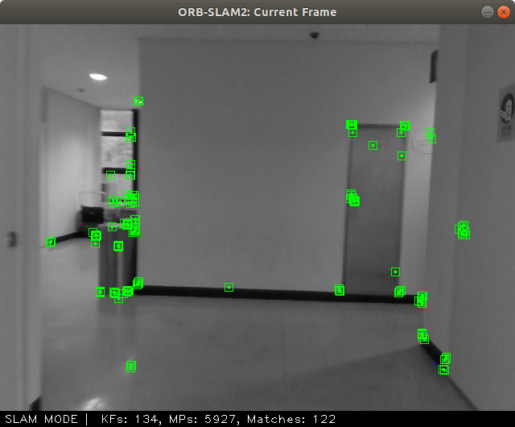
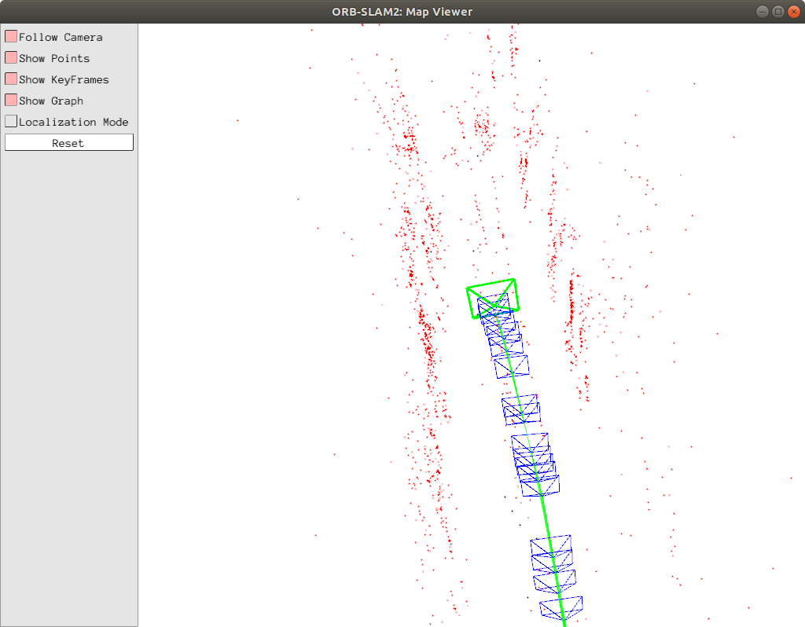

# orbslam-ros


This is a (docker-friendly) ros packages for orb slam2. \
Since original ros examples were outdated (as we don't use rosbuild_init or manifest.xml ...),\
I modified the CMakeLists and package.xml to make it run on your **"current" ros**. \
**Example .cc file (rgbd.cc) is the identical with the original.**\
(you can check here https://github.com/HyeonJaeGil/ORB_SLAM2/blob/master/Examples/RGB-D/rgbd_tum.cc)

<p align="center">
    
    
</p>

## How to use (with docker)
you first need to build orbslam2 with the instruction on https://github.com/HyeonJaeGil/ORB_SLAM2.git. \
In CMakeLists.txt file, you should change the **ORB_SLAM2_DIR** to the directory where you clone it. \
(Currently, it is __/root/ORB_SLAM2__.) \
Everything was tested on Docker(ROS Melodic, opencv3.4).\
But if ORB_SLAM2 were built successfully on your local machine, there would be no problem running this package on local. \
(You should change **ORB_SLAM2_DIR** in CMakeLists.txt, too!)

### Run docker container.
```
$ docker pull hyeonjaegil/orbslam:ros
$ docker run --gpus all --rm -it --ipc=host --net=host --privileged \
  --env="DISPLAY=unix$DISPLAY" \
  -v /tmp/.X11-unix:/tmp/.X11-unix:rw \
  --runtime=nvidia \
  -v /etc/localtime:/etc/localtime:ro \
  hyeonjaegil/orbslam2:ros
```

### Inside the container, run following command...
```
$ rosrun orbslam-ros RGBD \
  /root/ORB_SLAM2/Vocabulary/ORBvoc.txt \
  /root/catkin_ws/src/orbslam-ros/param/realsense.yaml
```
* For **Mono** or **Stereo** example, adjust yaml files (similar to original ORB SLAM2)
* You should prepare **external camera** so that it can publish image topics.

## P.S
Feel free to contact for other questions via email (h.gil@snu.ac.kr) or github issues.
